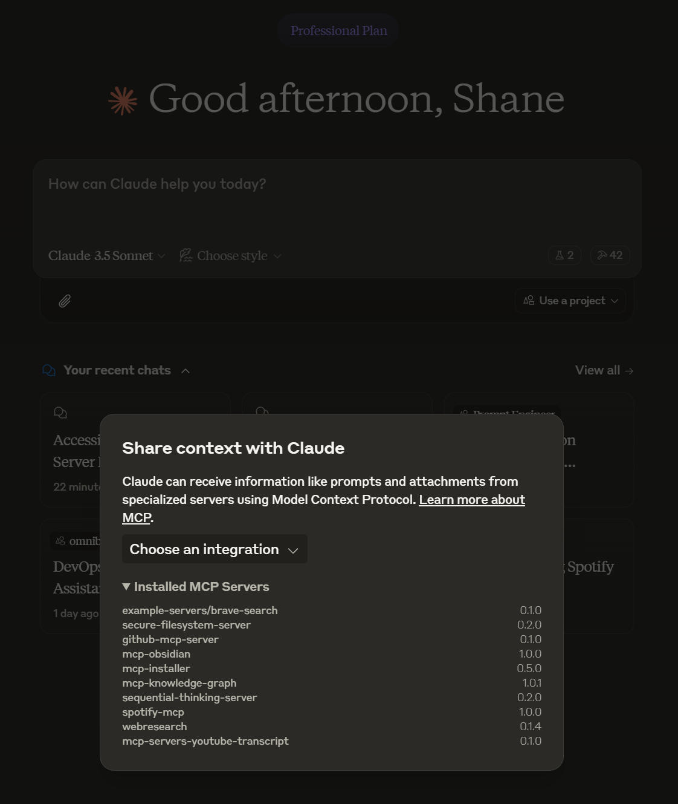

# Knowledge Graph Memory Server

[](https://smithery.ai/server/@itseasy21/mcp-knowledge-graph)

An improved implementation of persistent memory using a local knowledge graph with a customizable memory path and a refactored data structure.

This lets Claude remember information about the user across chats.

> [!NOTE]
> This is a fork of the original [Memory Server](https://github.com/modelcontextprotocol/servers/tree/main/src/memory) and is intended to not use the ephemeral memory npx installation method. It features a refactored storage model where Observations are top-level items.

## Server Name

```txt
mcp-knowledge-graph
```




## Core Concepts

The server stores information in a knowledge graph consisting of Entities, Relations, and Observations.

### Entities

Entities represent the core concepts or objects (e.g., people, places, projects). Each entity has:

- A unique `name` (string identifier, e.g., `Character-艾拉`)
- An `entityType` (string, e.g., `Character`, `Location`)
- Optional `aliases` (string array for alternative names)
- `createdAt` timestamp and `version` tracking

*Note: Observations are no longer stored directly within entities.*

Example Entity (in `memory.jsonl`):
```json
{"type":"entity","name":"Character-艾拉","entityType":"Character","aliases":["艾拉"],"createdAt":"2025-04-08T10:04:39.028Z","version":1}
```

### Relations

Relations define directed connections between entities, always described in active voice.

- `from`: Source entity name
- `to`: Target entity name
- `relationType`: Type of relationship (e.g., `认识`, `位于`, `发现`)
- `createdAt` timestamp and `version` tracking

Example Relation (in `memory.jsonl`):
```json
{"type":"relation","to":"Character-博士","from":"Character-艾拉","relationType":"认识","createdAt":"2025-04-08T10:04:41.347Z","version":1}
```

### Observations

Observations are individual pieces of information or facts associated with a specific entity. They are now stored as separate, top-level objects in the graph.

- `id`: A unique identifier for the observation (e.g., `obs_1744106684616_a18lxat`)
- `entityName`: The name of the entity this observation is about (links to an Entity)
- `content`: The observation text (string). Can optionally include prefixes for automatic parsing:
    - `[<ISO_Timestamp>]`: e.g., `[2025-04-08T10:00:00Z]`
    - `[S:<Status>]`: e.g., `[S:Active]`, `[S:Archived]`, `[S:Resolved]`, `[S:Background]`
- `timestamp`: (Optional) ISO timestamp string, automatically parsed from the content if present.
- `status`: (Optional) Status string (`Active`, `Resolved`, `Background`, `Archived`), automatically parsed from the content if present.
- `createdAt` timestamp and `version` tracking

**Important:** Observations with `status: 'Archived'` are filtered out during server startup (affecting the in-memory graph) and are **never** returned by query tools (`getContextInfo`, `searchNodes`, `openNodes`, `readGraph`), even if they temporarily exist in the `memory.jsonl` file.

Example Observation (in `memory.jsonl`):
```json
{"type":"observation","id":"obs_1744106684616_a18lxat","entityName":"Character-艾拉","content":"[2025-04-08T10:00:00Z] [S:Active] 状态: 健康","timestamp":"2025-04-08T10:00:00Z","status":"Active","createdAt":"2025-04-08T10:04:44.616Z","version":1}
```

## API

### Tools

- **`create_entities`**
  - Creates multiple new entities (without observations).
  - Input: `entities` (array of objects: `name`, `entityType`, optional `aliases`)
  - Ignores entities with existing names.

- **`create_relations`**
  - Creates multiple new relations between entities.
  - Input: `relations` (array of objects: `from`, `to`, `relationType`)
  - Skips duplicate relations.

- **`add_observations`**
  - Adds new observations, associating them with existing entities.
  - Input: `observations` (array of objects: `entityName`, `contents` [string array])
  - Parses `contents` for `[<ISO_Timestamp>]` and `[S:<Status>]` prefixes to populate observation metadata.
  - Creates new top-level observation objects.
  - Returns `{ addedObservationIds: string[] }` for each input entity.
  - Fails if the target entity doesn't exist. Skips adding if an observation with the exact same `entityName` and `content` already exists.

- **`delete_entities`**
  - Removes entities and their associated relations and observations.
  - Input: `entityNames` (string[])
  - Performs cascading deletion.

- **`delete_observations`**
  - Removes specific observations by matching `entityName` and the exact `content` string.
  - Input: `deletions` (array of objects: `entityName`, `observations` [string array of content to delete])

- **`delete_relations`**
  - Removes specific relations by matching `from`, `to`, and `relationType`.
  - Input: `relations` (array of objects: `from`, `to`, `relationType`)

- **`read_graph`**
  - Reads the entire knowledge graph.
  - No input required.
  - Returns the complete graph structure: `entities`, `relations`, and **non-archived** `observations`.

- **`search_nodes`**
  - Searches for entities based on a query.
  - Input: `query` (string[])
  - Searches across entity names, types, aliases, and observation content.
  - Returns matching entities, their relations, and their associated **non-archived** observations.

- **`open_nodes`**
  - Retrieves specific entities by name.
  - Input: `names` (string[])
  - Returns requested entities, relations between them, and their associated **non-archived** observations.

- **`update_entities`**
  - Updates fields (like `entityType` or `aliases`) of existing entities. Does **not** update observations.
  - Input: `entities` (array of objects: `name` [required], optional `entityType`, optional `aliases`)

- **`update_relations`**
  - Updates existing relations (currently only updates version/timestamp upon matching `from`, `to`, `relationType`).
  - Input: `relations` (array of objects: `from`, `to`, `relationType`)

- **`get_context_info`**
  - Retrieves detailed context for specified entities (matching names/aliases).
  - Input: `entityNames` (string[])
  - Returns:
    - The specified entities and any entities directly related to them.
    - All relations connecting these returned entities.
    - Associated **non-archived** observations for all returned entities, intelligently filtered and sorted (Active status first, then recent timestamped history, then untimestamped).

## Usage with Cursor, Cline or Claude Desktop

### Setup

Add this to your mcp.json or claude_desktop_config.json:

```json
{
    "mcpServers": {
      "memory": {
        "command": "npx",
        "args": [
          "-y",
          "@z503722728/mcp-knowledge-graph"
        ],
        "env": {
          "MEMORY_FILE_PATH": "/path/to/your/projects.jsonl"
        }
      }
    }
  }
```

### Installing via Smithery

To install Knowledge Graph Memory Server for Claude Desktop automatically via [Smithery](https://smithery.ai/server/@itseasy21/mcp-knowledge-graph):

```bash
npx -y @smithery/cli install @z503722728/mcp-knowledge-graph --client claude
```

### Custom Memory Path

You can specify a custom path for the memory file in two ways:

1. Using command-line arguments:
```json
{
  "mcpServers": {
    "memory": {
      "command": "npx",
      "args": ["-y", "@z503722728/mcp-knowledge-graph", "--memory-path", "/path/to/your/memory.jsonl"]
    }
  }
}
```

2. Using environment variables:
```json
{
  "mcpServers": {
    "memory": {
      "command": "npx",
      "args": ["-y", "@z503722728/mcp-knowledge-graph"],
      "env": {
        "MEMORY_FILE_PATH": "/path/to/your/memory.jsonl"
      }
    }
  }
}
```

If no path is specified, it will default to memory.jsonl in the server's installation directory.

### System Prompt

The prompt for utilizing memory depends on the use case. Changing the prompt will help the model determine the frequency and types of memories created.

Here is an example prompt for chat personalization. You could use this prompt in the "Custom Instructions" field of a [Claude.ai Project](https://www.anthropic.com/news/projects).

```txt
Follow these steps for each interaction:

1. User Identification:
   - You should assume that you are interacting with default_user
   - If you have not identified default_user, proactively try to do so.

2. Memory Retrieval:
   - Always begin your chat by saying only "Remembering..." and retrieve all relevant information from your knowledge graph
   - Always refer to your knowledge graph as your "memory"

3. Memory
   - While conversing with the user, be attentive to any new information that falls into these categories:
     a) Basic Identity (age, gender, location, job title, education level, etc.)
     b) Behaviors (interests, habits, etc.)
     c) Preferences (communication style, preferred language, etc.)
     d) Goals (goals, targets, aspirations, etc.)
     e) Relationships (personal and professional relationships up to 3 degrees of separation)

4. Memory Update:
   - If any new information was gathered during the interaction, update your memory as follows:
     a) Create entities for recurring organizations, people, and significant events
     b) Connect them to the current entities using relations
     b) Store facts about them as observations
```

## License

This MCP server is licensed under the MIT License. This means you are free to use, modify, and distribute the software, subject to the terms and conditions of the MIT License. For more details, please see the LICENSE file in the project repository.
